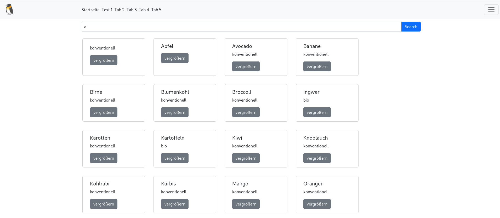

<!-- .slide: data-background="orange" -->

# Fragestellung <!-- .element class="r-fit-text" -->
- was sind typische Preise für alltägliche Produkte?
- wie viel Geld lohnt es sich für Bio Produkte auszugeben?

Notes: Test2

---

<!-- .slide: data-background="yellow" -->

# Das Endprodukt <!-- .element class="r-fit-text" -->
- Eine Website, die durchschnittliche Preise für Lebensmittel anzeigt.

---
<!-- .slide: data-background="green" -->

# Technologien <!-- .element class="r-fit-text" -->

----
<!-- .slide: data-background="green" -->
## SQLite 

----
<!-- .slide: data-background="green" -->
## Rust 

 
 

----
<!-- .slide: data-background="lightgreen" -->
## Bootstrap 

---
<!-- .slide: data-background="turquoise" -->

# Live-Demo <!-- .element class="r-fit-text" -->
<iframe src="">
</iframe>
 
---
<!-- .slide: data-background="blue" -->

# Screenshot <!-- .element class="r-fit-text" -->

---
<!-- .slide: data-background="purple" -->

# Ausblick <!-- .element class="r-fit-text" --> 
- Mehr Filter (Palmölfrei, Vegan, ...)
- Mehr Produkte 
- Quelle für Produktpreise (Webscraping von Lebensmittellieferdiensten, Crowdsourced, ...)
- ...
  
---
<!-- .slide: data-background="red" -->
        

